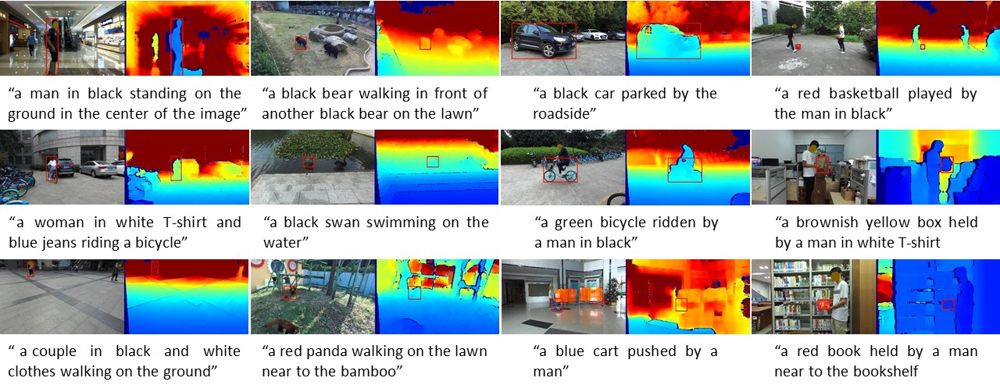

# UniMod1K: Towards a More Universal Large-Scale Dataset and Benchmark for Multi-Modal Learning

The dataset and codes of the paper **UniMod1K: Towards a More Universal Large-Scale Dataset and Benchmark for Multi-Modal Learning**

UniMod1K involves three data modalities: vision, depth, and language.
For the vision and depth modalities, the UniMod1K dataset contains 1,050 RGB-D sequences.
Regarding the language modality, the UniMod1K includes 1,050 sentences describing the target object in each video.
The link of the paper will be released soon. Here are some samples of the dataset:
<center></center>

## Download

The RGB-D images of UniMod1K dataset are available on [Baidu Cloud Disk](https://pan.baidu.com/s/1R3NG_-FKv6Ztx_aBwQJ4-w?pwd=ctnk) and [Google Drive](https://drive.google.com/drive/folders/1Z2PnWEgdZG0KVI2MX5chWddNlbuuEug3?usp=share_link).
Besides, the text files of the UniMod1K can be downloaded [here](https://drive.google.com/drive/folders/1xUWch1hBMe6ldpiKftumQidlftxsgWoG?usp=drive_link).

## Dataset
RGB-D sequences and the files of bounding box labels:
```
--UniMod1K
    |--Adapter
        |--adapter1
           |--groundtruth_rect.txt
           |--color
              |--00000001.jpg
              |--00000002.jpg
              ...
           |--depth
              |--00000001.png
              |--00000002.png
              ...
        |--adapter2
        ...
    |--Animal
       |--alpaca1
           |--groundtruth_rect.txt
           |--color
              |--00000001.jpg
              |--00000002.jpg
              ...
           |--depth
              |--00000001.png
              |--00000002.png
              ...
       |--bear1
        ...
    ...
```
The natural language files:
```
--UniMod1K
    |--Adapter
        |--adapter1
           |--nlp.txt
        |--adapter2
           |--nlp.txt
        ...
    |--Animal
       |--alpaca1
           |--nlp.txt
       |--bear1
           |--nlp.txt
        ...
    ...
```

## Dataset Format
The RGB images are saved in the 24-bit JPEG format with 8 bits allocated to each channel, whereas the depth maps are saved in the 16-bit PNG format.
For the labels, the format of rectangle bounding boxes is as [x1, y1, w, h]. (x1, y1) is the top-left corner of a targeted object, while the w and h are the width and height of the target bounding box.

## Data Visualisation
After downloading the data and corresponding label files, you can visualise the samples by:
```
cd /path/to/UniMod1K
export PYTHONPATH=/path/to/SPT:$PYTHONPATH
python ./read_dataset.py --data_dir '/path/to/UniMod1K/' --nlp_dir '/path/to/nlps/' --seq_id 0
```

## Baselines Codes and pre-trained models
完整的跟踪器代码位于 `SPT/` 目录，核心结构如下：

```
UniMod1K/
├── README.md
├── read_dataset.py
├── data_samples.jpg
└── SPT/
    ├── README.md              # 训练/测试说明
    ├── QUICK_START.md         # 快速上手指南
    ├── experiments/spt/*.yaml # 训练&测试配置
    ├── lib/                   # 模型、训练、测试源码
    ├── tracking/              # 测试入口脚本
    ├── train_improved.py      # 改进版训练脚本
    └── auto_clean.py          # 结果清理工具
```

简单使用流程：
1. 在 `SPT/lib/train/admin/local.py`、`SPT/lib/test/evaluation/local.py` 中写入各自的路径（workspace、数据集、网络、结果目录等）。
2. 训练模型
   ```bash
   cd SPT
   export PYTHONPATH=$(pwd):$PYTHONPATH
   python3 train_improved.py --config unimod1k_improved --run_name run_$(date +%m%d_%H%M)
   ```
3. 测试模型
   ```bash
   python3 tracking/test.py \
     --tracker_name spt \
     --tracker_param unimod1k \
     --dataset_name unimod1k \
     --runid 1 \
     --threads 0 \
     --num_gpus 1
   ```
   输出默认写到 `SPT/test/tracking_results`（可在 `local.py` 中调整）。

更详细说明请参阅 [SPT README](./SPT/README.md) 和 [Quick Start](./SPT/QUICK_START.md)。当前示例默认假设数据与预训练模型位于 `/root/autodl-tmp` 下，可根据实际环境修改。

> **Source**: 本仓库基于原始 UniMod1K 论文的公开实现（参考 [UniMod1K 官方仓库](https://github.com/xuefeng-zhu5/UniMod1K)）。本版本针对比赛需求做了工程化改造与长序列训练等增强。

## Monocular Depth Estimation
The subset for monocular depth estimation can be downloaded from [Baidu Cloud](https://pan.baidu.com/s/1ClHpwC1_BAN0GZSKT2jxaQ?pwd=l8um) or [Google Drive](https://drive.google.com/file/d/1aAokzgUssm26G_DHqKtF-FBzSErvpSrz/view?usp=drive_link).

## Contact
If you have any question, please feel free to contact **Ma Xu** at [b23041708@njupt.edu.cn](mailto:b23041708@njupt.edu.cn)
