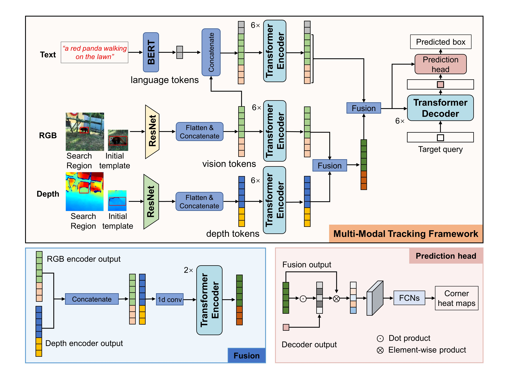

# SPT Tracking on UniMod1K

<p align="center">
  
</p>

本目录包含 UniMod1K 论文中的多模态追踪器 SPT 的官方实现，以及我们当前比赛使用的改进版训练脚本。

> **Source**: SPT 模块源自原始 UniMod1K 发布仓库（示例参考 [UniMod1K 官方仓库](https://github.com/Ma-Xu/UniMod1K)），本版本在其基础上进行了定制化修改。

---

## 1. 环境与依赖

```bash
cd /root/autodl-tmp/UniMod1K/SPT
conda env create -f environment.yml
conda activate spt
export PYTHONPATH=$(pwd):$PYTHONPATH
```

> `jpeg4py` 需要系统安装 `libturbojpeg`。Ubuntu 上执行 `sudo apt-get install libturbojpeg`。

---

## 2. 数据与预训练模型

请确保以下文件存在（可根据实际目录调整）：

```
/root/autodl-tmp
├── data/1-训练验证集/TrainSet/…         # RGB/Depth + NLP (nlp.txt) 组织方式同原数据
├── STARKS_ep0500.pth.tar                 # STARK-S 预训练权重
└── bert/
    ├── bert-base-uncased.tar.gz
    └── bert-base-uncased-vocab.txt
```

更新 `experiments/spt/unimod1k.yaml`（或 `unimod1k_improved.yaml`）中的路径：

```yaml
MODEL:
  PRETRAINED: '/root/autodl-tmp/STARKS_ep0500.pth.tar'
  LANGUAGE:
    PATH: '/root/autodl-tmp/bert/bert-base-uncased.tar.gz'
    VOCAB_PATH: '/root/autodl-tmp/bert/bert-base-uncased-vocab.txt'

PATHS:
  DATA_ROOT: '/root/autodl-tmp/data/1-训练验证集/TrainSet'
  NLP_ROOT:  '/root/autodl-tmp/data/1-训练验证集/TrainSet'
  OUTPUT_DIR: '/root/autodl-tmp/spt_runs'
```

`OUTPUT_DIR` 会自动生成 `/<config>/<run_name>/` 子目录，保存 checkpoints、日志、tensorboard、metadata、配置快照等。

---

## 3. 启动训练

### 标准训练
```bash
python3 lib/train/run_training.py \
  --config unimod1k \
  --run_name baseline_$(date +%m%d_%H%M)
```

### 改进版训练（长序列采样等增强）
```bash
python3 train_improved.py \
  --config unimod1k_improved \
  --run_name improved_$(date +%m%d_%H%M)
```

可选参数：
- `--run_name`：自定义实验名称；默认使用时间戳。
- `--output_root`：覆盖 YAML 中的 `PATHS.OUTPUT_DIR`。
- `--auto_eval`/`--eval_epochs`（仅 `train_improved.py`）：训练中按指定 epoch 自动调用评测脚本。

运行日志保存在 `runs/<config>/<run_name>/logs/`。目录下还会生成 `metadata/`（包含配置快照与 git 信息）。

---

## 4. 监控与评测

```bash
# 日志
tail -f /root/autodl-tmp/spt_runs/<config>/<run_name>/logs/*.log

# tensorboard（如配置）
tensorboard --logdir /root/autodl-tmp/spt_runs/<config>/<run_name>/tensorboard --port 6006

# GPU 监控
watch -n 1 nvidia-smi
```

评测模型：
1. 在配置文件里设置 `TEST.EPOCH` 为要评测的 checkpoint 编号。
2. 运行：
   ```bash
   python3 tracking/test.py \
     --tracker_name spt \
     --tracker_param unimod1k \
     --dataset_name unimod1k \
     --runid 1 \
     --threads 0 \
     --num_gpus 1
   ```
3. 结果保存在 `lib/test/tracking_results/spt/<tracker_param>_001/`。

---

## 5. 清理旧实验

使用 `auto_clean.py` 释放空间，例如仅保留每个配置最新 3 个 run：

```bash
python3 auto_clean.py \
  --root /root/autodl-tmp/spt_runs \
  --keep 3 \
  --force
```

支持 `--config unimod1k_improved` 指定配置、`--quiet` 安静输出等。

---

## 6. 更多说明

- 详细的分步操作请参见 [`QUICK_START.md`](./QUICK_START.md)。
- 若需要调整数据读取或训练策略，可参考源码中 `lib/train/base_functions.py`、`lib/train/data/sampler_longseq.py`、`lib/train/actors/spt.py`。
- 评测/集成 VOT Toolkit 的旧文档已移除；如需使用，可自行参考 VOT 官方指南。

---

## 致谢

本项目基于 [STARK](https://github.com/researchmm/Stark) 实现，感谢原作者开源贡献。
